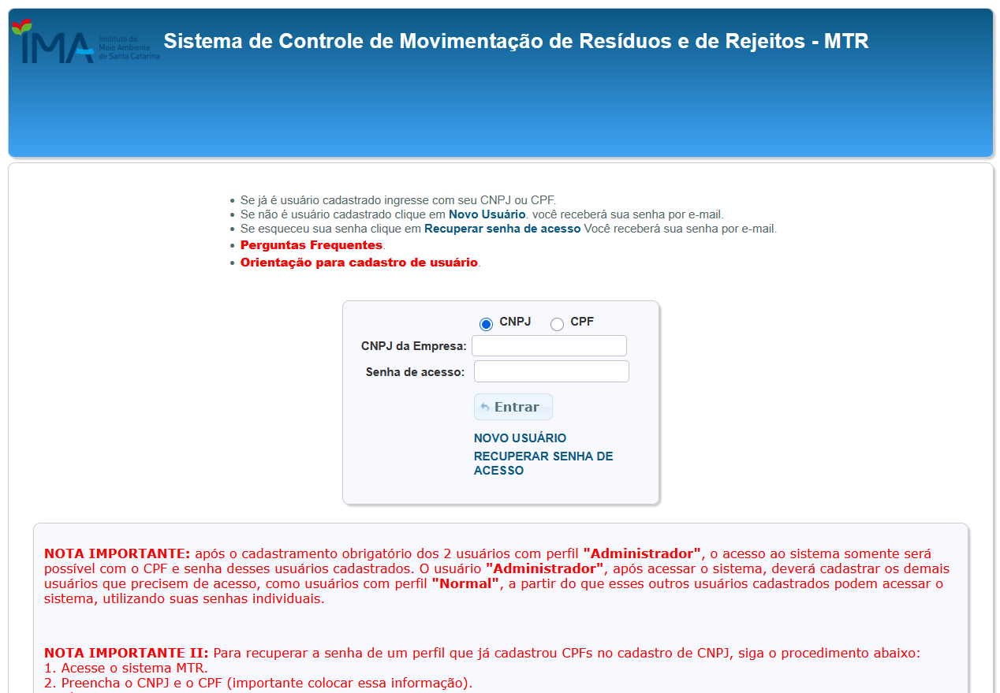
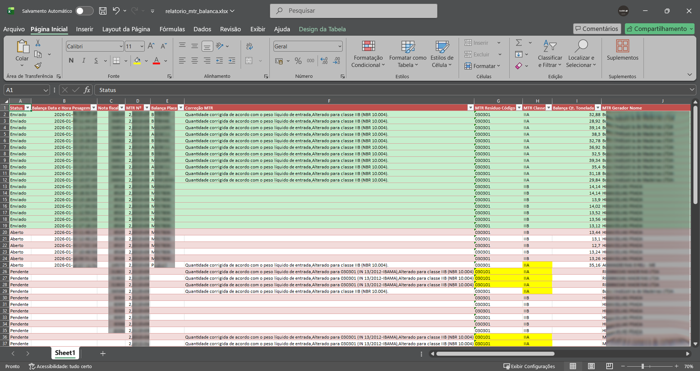

# Automação de MTR – Integração com Balança

Este projeto automatiza o processo de **consulta, conferência e recebimento de MTRs** no sistema do IMA/SC, integrando dados do **MTR** com informações da **balança** armazenadas em banco de dados SQL Server. Além disso, o sistema gera um **relatório Excel formatado**, com validações, correções automáticas e acompanhamento de status.



---

## Funcionalidades

- Login automático no sistema MTR (Playwright)
- Download e processamento do relatório de MTRs
- Integração com banco de dados (SQL Server via ODBC)
- Cruzamento de dados MTR × Balança
- Geração de relatório Excel com:
  - Tabela formatada
  - Destaque visual de inconsistências
  - Coluna de status (Pendente / Aberto / Enviado / Erro)
- Recebimento automático de MTRs
- Aplicação de correções conforme normas ambientais
- Execução segura com variáveis de ambiente

---

## Tecnologias Utilizadas

- Python 3.10+
- Playwright (sync)
- Pandas
- OpenPyXL
- PyODBC
- Tkinter
- dotenv

---

## Pré-requisitos

Certifique-se de ter os seguintes itens instalados em sua máquina antes de começar:

- Python 3.10 ou superior
- Git
- SQL Server com o driver ODBC configurado
- Navegador compatível com o Playwright (Chromium, Firefox ou Webkit)

---

## Instalação

1. Clone o repositório:

```bash
git clone https://github.com/seu-usuario/mtr-automation.git
cd mtr-automation
```

2. Crie um ambiente virtual (opcional, mas recomendado):

```bash
python -m venv venv
source venv/bin/activate  # Linux/Mac
venv\Scripts\activate     # Windows
```

3. Instale as dependências:

```bash
pip install -r requirements.txt
playwright install
```

---

## Configuração

Crie um arquivo `.env` na raiz do projeto com as seguintes variáveis de ambiente. Você pode usar o arquivo `.env.example` como referência, copiando-o e renomeando para `.env`:

```bash
cp .env.example .env
```

Preencha as variáveis no arquivo `.env` com as informações apropriadas para o seu ambiente:

```env
DB_DRIVER=ODBC Driver 17 for SQL Server  # Driver ODBC para conexão com o SQL Server
DB_HOST=localhost                      # Endereço do servidor SQL Server
DB_NOME=Supervisor                     # Nome do banco de dados
DB_USUARIO=usuario                     # Usuário do banco de dados
DB_SENHA=sua_senha                     # Senha do banco de dados

MTR_LOGIN_CNPJ=seu_cnpj                # CNPJ para login no sistema MTR
MTR_LOGIN_CPF=seu_cpf                  # CPF do usuário para login no sistema MTR
MTR_LOGIN_SENHA=sua_senha              # Senha para login no sistema MTR

RECEBEDOR=nome_do_recebedor            # Nome do recebedor para o relatório
HEADLESS=0                             # 0 para exibir o navegador, 1 para modo headless
PRODUCAO=0                             # 0 para modo de teste, 1 para modo de produção
```

> **Nota:** Nunca versione o arquivo `.env` para manter suas credenciais seguras. O arquivo `.env.example` pode ser versionado para servir como modelo.

---

## Segurança

- **Nunca compartilhe seu arquivo `.env` publicamente**. Ele contém informações sensíveis, como senhas e credenciais de acesso.
- Certifique-se de que o arquivo `.env` está listado no `.gitignore` para evitar que seja enviado ao repositório.
- Use variáveis de ambiente seguras em servidores de produção para evitar expor informações sensíveis.

---

## Como executar

Execute o seguinte comando para iniciar o sistema:

```bash
python main.py
```

Durante a execução:

- Será solicitado o local para salvar o relatório Excel.
- O sistema processará os MTRs automaticamente.
- Em caso de erro, screenshots serão gerados para auditoria.

---

## Relatório Gerado

O relatório Excel gerado contém:

- Validações automáticas
- Correções sugeridas conforme normas
- Destaques visuais por status
- Histórico de envio e erros

O screenshot abaixo mostra um relatório gerado pelo sistema em ambiente de produção com dados reais e mascarados.



---

## Contribuição

Contribuições são bem-vindas! Siga os passos abaixo para contribuir com o projeto:

1. Faça um fork do repositório.
2. Crie um branch para sua feature ou correção de bug: `git checkout -b minha-feature`.
3. Faça suas alterações e adicione os commits: `git commit -m 'Minha nova feature'`.
4. Envie suas alterações para o repositório remoto: `git push origin minha-feature`.
5. Abra um Pull Request explicando suas alterações.

---

## Contato

Se tiver dúvidas ou sugestões, entre em contato:

- **Nome:** João Cardoso
- **Email:** srv.joaocardoso@gmail.com
- **LinkedIn:** [Seu LinkedIn](https://www.linkedin.com/in/srv-joao-cardoso)
- **GitHub:** [Seu GitHub](https://github.com/srv-joaocardoso)

---

## Licença

Este projeto está licenciado sob a **Creative Commons Attribution-NonCommercial 4.0 International (CC BY-NC 4.0)**. Isso significa que você pode usar, modificar e compartilhar este projeto, desde que não seja para fins comerciais e que seja dado o devido crédito ao autor.

Para mais detalhes, consulte [Creative Commons BY-NC 4.0](https://creativecommons.org/licenses/by-nc/4.0/).